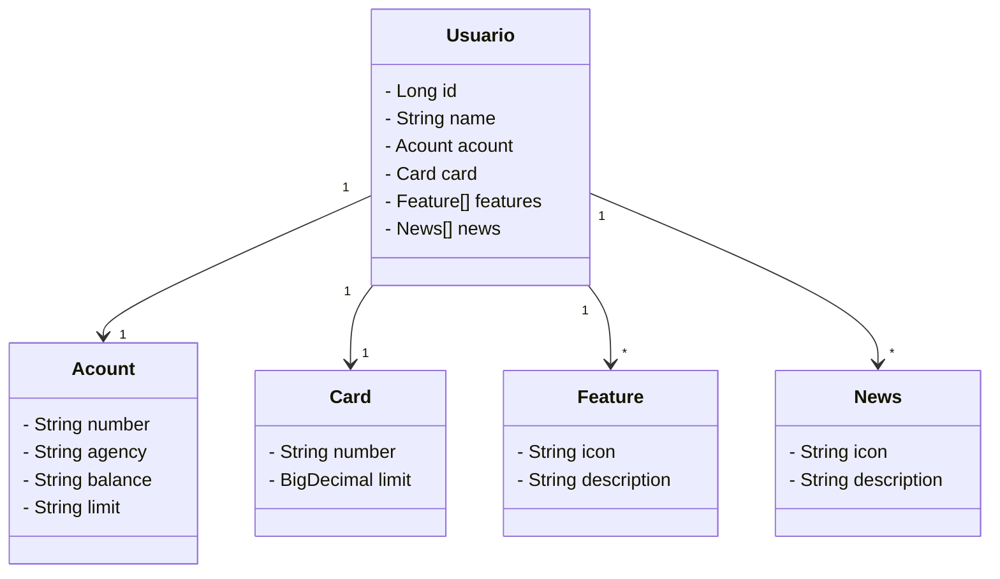

# DEV-WEEK

Java RESTful API 

## Diagrama de Classes 

```mermaid
classDiagram
    class Usuario {
        - Long id
        - String name
        - Acount acount
        - Card card
        - Feature[] features
        - News[] news
    }

    class Acount {
        - String number
        - String agency
        - String balance
        - String limit
    }

    class Card {
        - String number
        - BigDecimal limit
    }

    class Feature {
        - String icon
        - String description
    }

    class News {
        - String icon
        - String description
    }

    Usuario "1" --> "1" Acount
    Usuario "1" --> "1" Card
    Usuario "1" --> "*" Feature
    Usuario "1" --> "*" News

```
